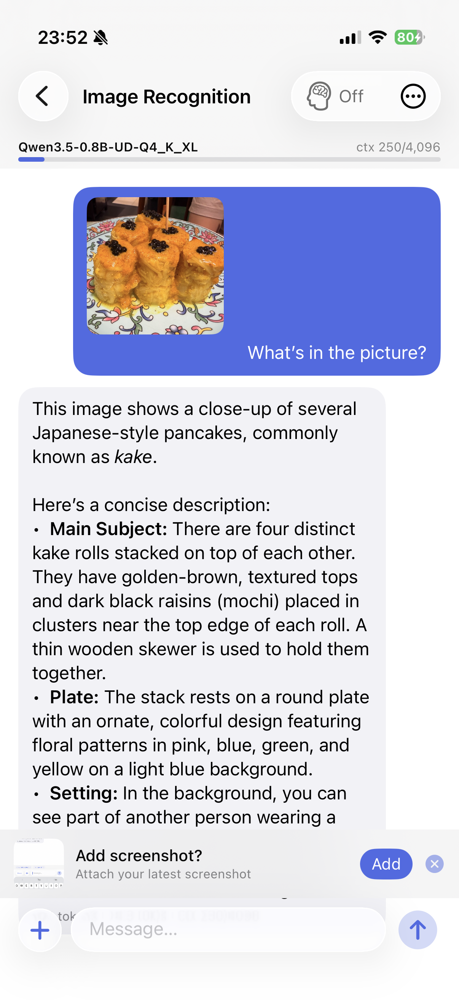
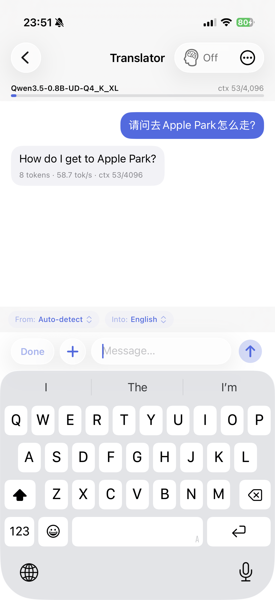
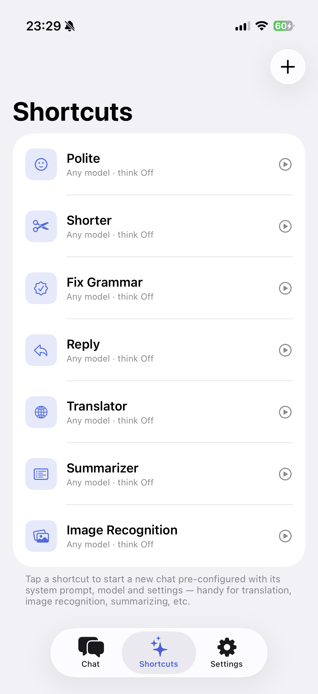
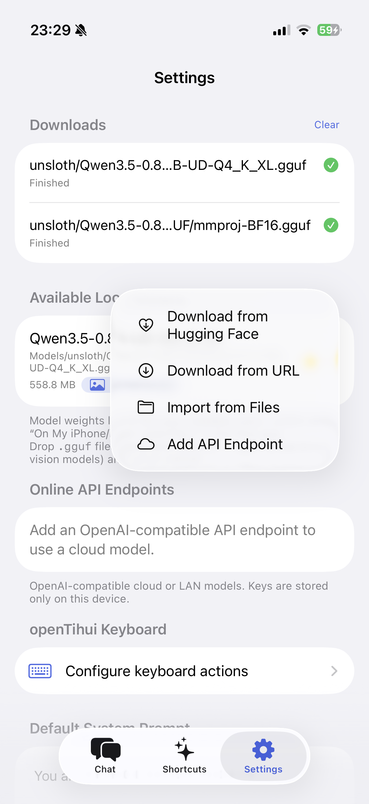
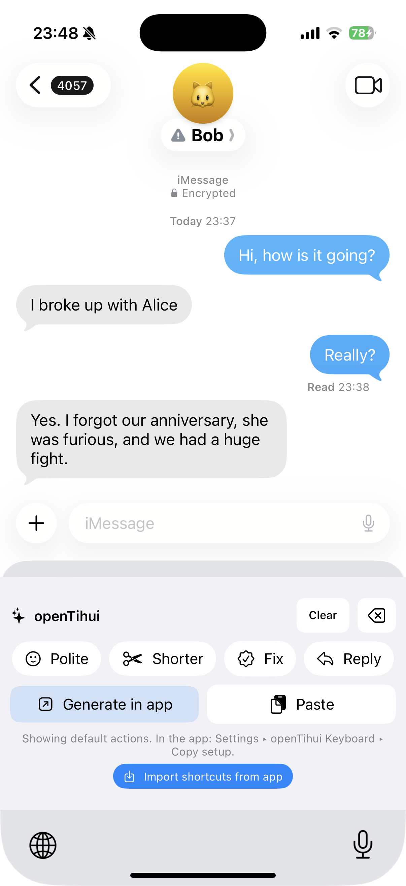
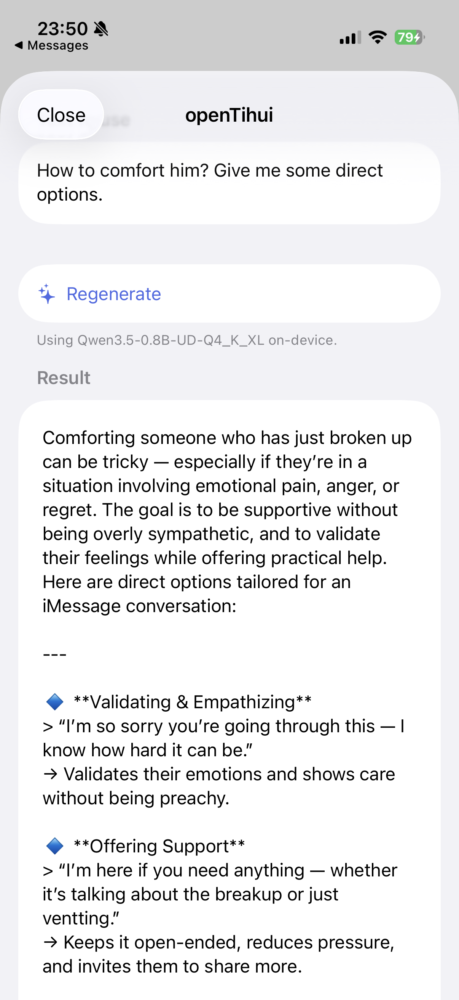
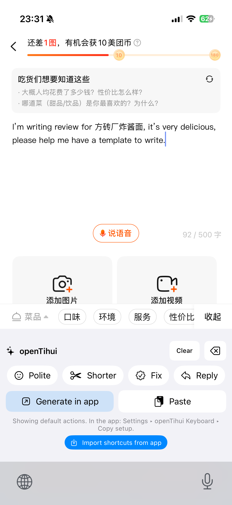
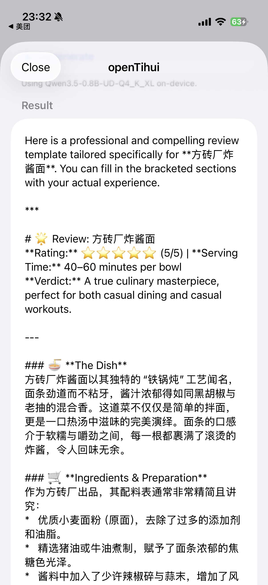

# openTihui — on-device LLM for iOS

<p align="center">
  
</p>

<p align="center">
  <a href="https://github.com/cyyself/OpenTihui">github.com/cyyself/OpenTihui</a>
</p>

A native SwiftUI app for iPhone and iPad that runs GGUF language models **fully
on-device** with [llama.cpp](https://github.com/ggml-org/llama.cpp) and
can also talk to **OpenAI-compatible cloud APIs**.
It supports text **and** image input (vision models such as Qwen3-VL),
per-chat configuration, conversation/context management, and downloading models
straight from Hugging Face.

> Note on "Apple MLX": llama.cpp's GPU backend on Apple devices is **Metal**, not
> MLX. This app uses the Metal backend — enabled automatically on capable GPUs
> (M1+ / A14+), with a CPU fallback on older ones — the correct, supported
> acceleration path on iOS.

## Screenshots

<table>
  <tr>
    <td align="center"><br>Vision chat</td>
    <td align="center"><br>Translator</td>
    <td align="center"><br>Shortcuts</td>
    <td align="center"><br>Settings</td>
  </tr>
  <tr>
    <td align="center"><br>Keyboard shortcuts</td>
    <td align="center"><br>Reply via Generate</td>
    <td align="center"><br>Generate in app</td>
    <td align="center"><br>Generate in app</td>
  </tr>
</table>

## Features

- **Three tabs** — **Chat**, **Shortcuts**, **Settings**. Model management lives
  at the top of **Settings**.
- **Chat** with streaming token output rendered as **Markdown** (bold, lists,
  headings, code blocks), a live context-usage meter, and a realistic
  **tokens/sec** readout.
- **Local *or* cloud models** — run a GGUF on-device, or add an
  **OpenAI-compatible API endpoint** (OpenAI, OpenRouter, Groq, DeepSeek, a local
  `llama-server`, …) and chat against it. The same chat UI drives both; vision
  images are sent as base64 data URLs to APIs that support them.
- **Multiple conversations** — saved to disk, switchable from the chat list,
  auto-titled from the first message, swipe to delete. Each chat keeps its own
  model, system prompt, config, and history. **Export any chat as PDF or JSON**
  (images embedded as base64) — long-press a chat in the list, or use the **•••**
  menu inside a chat. PDF rendering runs off the main thread with a progress
  overlay.
- **Shortcuts** — reusable presets (Polite, Shorter, Fix Grammar, Reply,
  Translator, Summarizer, …). Each bundles a **system prompt + preferred model +
  per-chat config**. Tapping one starts a pre-configured chat; they also drive the
  keyboard's chips. **Export / import a shortcut as a JSON file** (share it, or
  open one to import). Reset-to-defaults lives in Settings.
- **Per-chat & default settings** — model, name, icon, context length, sampling,
  reasoning effort, system prompt, **load-projector** toggle, a **discard-context**
  (stateless) mode, **auto-context** (auto-fill from the clipboard on open /
  auto-attach a recent screenshot when sending), and an **image-compression size**.
  The same editor drives **Shortcuts** and the **Default Generation Settings**
  (Settings) used by new chats and the keyboard's generic *Generate in app*.
- **Prompt variables** — reference variables in a system prompt as **`$name`**
  (highlighted in blue in the editor; tap one from the bar **above the keyboard**
  to insert it). Each variable's **list of options** is defined separately in
  **Shortcut settings or Chat settings** (a chat inherits a shortcut's variables
  and can override them). A bar above the composer lets you pick values per chat —
  e.g. the built-in **Translator** exposes *from* / *into* language pickers
  (English, Chinese, …). Values are substituted before the prompt reaches the
  model, remembered for next time, and saved per chat.
- **Reasoning UI + tunable thinking effort** — `<think>…</think>` output renders
  as a collapsible "Thoughts" block (live spinner while reasoning). Effort
  (Off / Low / Medium / High) is per-chat: Off skips reasoning, Low/Medium cap
  it, High is unlimited. Default is Low.
- **Multimodal input** — the composer's **+** attaches photos from the library or
  the **camera**; media is spliced into the prompt via `libmtmd` (`<__media__>`
  markers). When a vision model is loaded and you **take a screenshot**, the app
  offers to attach it (recent-screenshot suggestion, needs Photos access). Images
  are **downscaled** to a configurable max size before inference to cut vision
  tokens, encode time, and storage.
- **Lazy model loading** — opening a chat doesn't load the model; tap **Load**, or
  just send a message and it loads first. A **default model** is set in **Settings
  ▸ Models**; missing model files are handled gracefully.
- **Context management** — context length is adjustable per chat and resizing
  **migrates the KV cache without a reload** when possible. When the window fills,
  the oldest middle of the conversation is **auto-compacted** on the next message
  (system prompt preserved). If a single turn still overflows on a model that
  can't shift in place (e.g. a large image), it **compacts and retries once**.
- **Sampling controls** — temperature, top-P, top-K, min-P, repeat penalty, and
  **max tokens** (defaults to **Auto** = the full context window).
- **GPU (Metal)** — used automatically on capable GPUs (**Apple7 / M1 and newer**);
  older GPUs (e.g. A12 and earlier) **fall back to CPU** to avoid Metal faults. The
  multimodal projector follows the same choice. Status is shown in **Settings ▸
  About**, with the resolved backend once a model is loaded.
- **Logs** — **Settings ▸ Logs** shows the captured **llama.cpp / ggml** output
  (model load, backend init, context sizing, …); auto-refreshing, with copy /
  share / clear.
- **Localized** — UI **and** default shortcut/system prompts in **English, 简体中文,
  繁體中文** (via a String Catalog; follows the device language), so on-device
  output matches your language. Chat bubbles support **text selection** and a
  **Speak** (text-to-speech) action on long-press.

### Model management & downloads

- **Curated model catalog** — Settings ▸ Models → **+** → *Recommended Models*:
  one-tap downloads of known-good mobile models (Qwen3.5 0.8B / 2B, Gemma 4
  E2B / E4B — unsloth Q4_K_XL quantizations), each with the right projector.
- **Recommended starter model** — when you have no on-device models, Settings ▸
  Models offers a one-tap download of **Qwen3.5 0.8B** (vision) + its projector.
- **Download from a URL** — paste a direct GGUF link (e.g. a Hugging Face
  `resolve` URL) plus an optional `mmproj` link.
- **Background download manager** — downloads keep running while you browse away;
  a **Downloads** section shows per-file progress with **cancel**. Downloads
  **mirror the Hugging Face repo layout** (`Models/<owner>/<repo>/…`), so a model
  and its `mmproj` (and any shards) stay grouped and are paired automatically.
- **Import from Files**, or drop `.gguf` files into **On My iPhone/iPad ▸
  openTihui ▸ Models** in the Files app and pull-to-refresh. Subfolders are
  **scanned recursively**, and projectors are paired with the model in the same
  folder.
- **Choose the multimodal projector** per model — same-folder projectors are
  paired by default; the picker disambiguates same-named files by path (`./` for
  the model's own folder) and lets you select **None** to run text-only. The
  choice is remembered per model.
- **Rename a model** (display name only; the file on disk is untouched), and see
  same-named models in different folders disambiguated by their path.
- **Auto-discovers** a Qwen3-VL test model from the developer cache in the Simulator.

### openTihui keyboard (system-wide)

A custom keyboard extension lets you generate text **in any app** without leaving
the field you're typing in. It's a **real keyboard** — English QWERTY with
numbers/symbols layers (typing works even without Full Access) — and **swiping
up** (or tapping **✨**) reveals the AI panel. Because iOS caps keyboard-extension
memory (it can't run a model itself), the panel is a **launcher**: it shows your
**Shortcuts** as chips and hands the work to the openTihui app.

- The keyboard's chips are your **Shortcuts** (Polite, Shorter, Fix Grammar, Reply,
  Translator, … — add your own in the Shortcuts tab). Tap one (or **Generate in
  app**) and the text before the cursor is sent to openTihui via
  `opentihui://compose`. **Pick which shortcuts appear** (no fixed limit — the
  chips scroll) in **Settings ▸ openTihui Keyboard** — the keyboard picks them up
  **automatically** via a shared App Group container. (On builds without the App
  Group entitlement, **Copy setup for keyboard** + import in the keyboard is the
  fallback.) The keyboard UI **follows the app's language**.
- In the app you **tune the task** — pick options for shortcuts with `$variables`
  (e.g. Translator's from/into language, remembered for next time), edit the text,
  and open **Generation settings** to change the **model, reasoning, context length,
  image compression**, and sampling for this run — then it generates (common cases
  generate automatically). **Use
  this result** copies it back; return to your app and tap **Insert result** in
  the keyboard. A shortcut set to **use the clipboard / a recent screenshot** as
  context fills it in automatically.

Enable it in **Settings ▸ General ▸ Keyboard ▸ Keyboards ▸ Add New Keyboard ▸
openTihui**, then turn on **Allow Full Access** (required for the keyboard to
read the shared settings/results — typing works without it). App ⇄ keyboard data
flows through a private **App Group** container (`APP_GROUP_ID` build setting),
with the clipboard as a fallback. Forks: change `PRODUCT_BUNDLE_IDENTIFIER` and
`APP_GROUP_ID` to your own (group IDs are unique per team; App Groups also work
with free personal teams, and without the entitlement everything falls back to
the clipboard flow).

## Building

Requirements: Xcode 16+ (developed against Xcode 26), an iOS 17+ device or simulator.

The simplest path is the top-level **Makefile**, which builds the llama.cpp
xcframework (device + simulator, incl. `libmtmd`) and then the app:

```bash
git clone https://github.com/cyyself/OpenTihui && cd OpenTihui
make            # builds the xcframework (first run only) + the app for the Simulator
make run        # build, install, and launch in the booted Simulator
```

Local fixes to llama.cpp live as `patches/llama.cpp/*.patch`, applied
automatically by the framework build (see `patches/llama.cpp/README.md`).

Other targets: `make framework` (force-rebuild the xcframework), `make app`
(reuse the existing one), `make clean`, `make distclean`, and `make icon`
(regenerate the app icon from `design/AppIcon.tex`). Override the configuration or
destination, e.g. `make app CONFIG=Release DEST='platform=iOS,name=My iPhone'`.

> The built `Frameworks/llama.xcframework` is **not** committed (its dSYMs exceed
> GitHub's 100 MB file limit); `make` produces it from the `llama.cpp` submodule.

To work in Xcode directly: run `make framework` once, then `open
openTihui.xcodeproj`, pick the `openTihui` scheme, and set your signing team for
on-device runs.

## Project layout

```
Makefile                       build the xcframework, then the app
llama.cpp/                     git submodule (ggml-org/llama.cpp)
Frameworks/llama.xcframework   built by `make framework` (gitignored)
scripts/build-llama-ios.sh     builds the xcframework (run from inside llama.cpp/)
Config/                        Info.plist (ATS, usage strings), entitlements
openTihui.xcodeproj            hand-authored project (synchronized folder groups)
src/openTihui/
  Bridge/                      Objective-C++ facade over llama.cpp + mtmd
    LlamaBridge.h/.mm          load, tokenize, decode, sample, multimodal eval, context resize
  Models/                      ChatViewModel, InferenceEngine, ModelStore, GenConfig,
                               Shortcut, Conversation, DownloadManager, RemoteEndpoint,
                               OpenAIClient, ScreenshotSuggester, AppSettings, CloudSync, …
  Views/                       ChatView, ModelManagerView, RecommendedModelsSheet,
                               DownloadModelSheet, ComposeView, ChatSettingsView, …
  SmokeTest.swift              env-gated end-to-end self-test
src/Keyboard/                  custom keyboard extension (app-extension target)
  KeyboardViewController.swift host UIInputViewController + host-field bridge
  KeyboardRootView.swift       SwiftUI keyboard UI (action chips, hand-off)
  KeyboardAI.swift             chip config imported from the app (keyboard has no network code)
  Info.plist                   NSExtension (keyboard-service, RequestsOpenAccess)
design/AppIcon.tex             TikZ source for the app icon (regen: `make icon`)
Screenshots/                   README screenshots
```

## How multimodal works

Per turn the app builds a ChatML delta with a `<__media__>` marker per
attachment, hands it to `LlamaBridge`, which calls `mtmd_tokenize` +
`mtmd_helper_eval_chunks` to encode images and decode text into the KV cache,
then runs the standard sampling loop. Only the new turn's tokens are processed
each time (incremental KV cache); auto-compaction keeps long chats alive. For
cloud endpoints the same turns are streamed via the OpenAI `/chat/completions`
SSE API instead.

## Self-test

An end-to-end smoke test is gated behind an env var (never runs for users) and
logs with the `SMOKETEST:` prefix:

```bash
# text + image inference against the discovered test model
SIMCTL_CHILD_LLAMACHAT_SMOKETEST=1 xcrun simctl launch <device> org.cyyself.opentihui

# download → register → load → generate
SIMCTL_CHILD_LLAMACHAT_SMOKETEST=2 \
SIMCTL_CHILD_DL_MODEL_URL="https://…/model.gguf" \
  xcrun simctl launch <device> org.cyyself.opentihui
```

## Contributing

Contributions are welcome! The repo lives at
**<https://github.com/cyyself/OpenTihui>** — open an issue for bugs/ideas, or send
a pull request. The codebase is plain SwiftUI + a small Objective-C++ bridge over
llama.cpp/`libmtmd` (see **Project layout** above); `make run` builds and launches
in the Simulator. Please keep UI strings localized via the String Catalogs
(`Localizable.xcstrings`) so English / 简体中文 / 繁體中文 stay in sync.

## Notes / limitations

- Metal GPU is used **only on Apple7 / Metal3 GPUs and newer** (A14 / M1+).
  ggml-metal's kernels fault on older GPUs (e.g. A12 / A12Z) and the Simulator, so
  those run on **CPU** automatically (the projector follows the same choice). The
  resolved backend is shown in **Settings ▸ About**.
- Input is **text + images**, plus **audio** on audio-capable models (e.g.
  Gemma 4 mobile with its projector; recordings are capped at 60 s).
- Prompt formatting auto-detects the model family from the GGUF's chat template
  (ChatML/Qwen and Gemma turn tags); other families may need a different template.
- The M-RoPE models (Qwen-VL) can't use llama.cpp's in-place context shift, so
  compaction is done at the app level by dropping and replaying turns.
- **Configuration is stored as plain JSON** under **Documents/Config**
  (`settings.json`, `shortcuts.json`, `endpoints.json`, `models.json`) — visible
  and editable in the Files app. **Chat history is private** (Application Support,
  not exposed in Files). No iCloud / cloud sync; everything is on-device. API keys
  (`endpoints.json`) are written with complete file protection.

## Privacy

Everything runs on-device; no analytics, no tracking, no server. Data leaves the
device only toward endpoints **you** configure. See [PRIVACY.md](PRIVACY.md).

## License

[MIT](LICENSE) © 2026 Yangyu Chen. Built on
[llama.cpp](https://github.com/ggml-org/llama.cpp) and ggml (also MIT).
